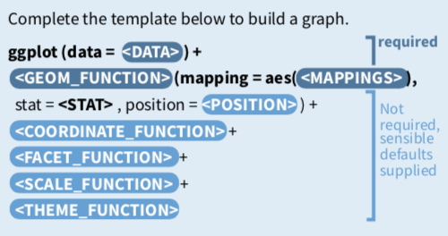

```{r setup, include=FALSE}
knitr::opts_chunk$set(echo = TRUE)
knitr::opts_chunk$set(dev='png', fig.align = 'center', fig.height = 4, fig.width = 6) 
library(tidyverse)

```

# Lesson 6: Data Visualization with `ggplot2`

So far, we've seen how to do some 'quick and dirty' plots with plotting functions like `hist()` and `plot()` which are built into base R. There is another graphics package for R called `lattice`. The tidyverse has its own paradigm for creating graphics called `ggplot`. The advantage to using `ggplot` over base R functions is that the gpplot paradigm comes with many built in defaults to make your plots look nice without having to code too much customization. As we go through some examples, note how ggplot has automatically chosen colour schemes, scales, and axis labels for us, without us specifying any of this. Of course, we can override these, but having some usable defaults built in makes it very fast to produce nice plots.

## Useful resources for `ggplot2`
For inspiration and for help creating graphics with `ggplot2`, bookmark these pages:  

* THE R GRAPH GALLERY <http://www.r-graph-gallery.com/portfolio/ggplot2-package/>  

* COOKBOOK for R >> Graphs  <http://www.cookbook-r.com/Graphs/>  

* CHEAT SHEET for `ggplot2`
<https://www.rstudio.com/wp-content/uploads/2016/11/ggplot2-cheatsheet-2.1.pdf>  

## What is ggplot?
The "gg" in "ggplot" stands for "grammar of graphics", and the basic idea is this: when you plot data, you are creating a visual representation of numeric or categorical information within a coordinate system.  The most basic example is a scatterplot; the position of a point on the x axis reflects one variable, and the position on the y axis reflects another variable. That works well for simple examples, but often we have a large number of parameters that we'd like to display.  Ideally, we want a clear, flexible framework that maps arbitrary variables to arbitrary visual elements or aesthetics, such as x position, y position, size, color, shape, transparency, etc.  This would let us rapidly explore different ways of looking at our data to see what is the most helpful.  `ggplot` provides this sort of framework, with a clean mapping of variables to output.

In other words, `ggplot2` maps data to aesthetics and it does so in layers. There are several types of layers we'll learn about, including geometric objects, statistical transformations, and position adjustments. We can see how this works by examining the syntax. We initialize a plot with `ggplot()` and then add the layers with instructions for mapping. We can also add other functions to further customize our graphic.  

```{r, echo = FALSE}
# All defaults

```


Let's illustrate this using data from the 2003-2004 NHANES Survey that measured iron status markers in children aged 3-5 years old.  

Read in the data file, NHANES_FeMarkers_3to5y.csv, clean it up, and take a look at the data.  
```{r}
nhanes_fe <- read_csv(file = "Data_Files/NHANES_FeMarkers_3to5y.csv",
                      col_types = cols(Subject = col_factor(),
                                       Gender = col_factor(),
                                       Age_months = col_integer(),
                                       Race_ethn = col_factor())) %>%
              mutate(Gender = recode(Gender, 
                                     `1` = "Male", `2` = "Female"),
                     Race_ethn = recode(Race_ethn, 
                                        `1` = "Mexican American", 
                                        `2` = "Other Hispanic",
                                        `3` = "Non-Hispanic White",
                                        `4` = "Non-Hispanic Black",
                                        `5` = "Other Race - Including Multi-Racial"))

glimpse(nhanes_fe) #demographics and lab values

```
  
## Plotting with Continuous Variables  
Scatterplots are one of the most commonly used graphics in laboratory medicine. Let's create a scatterplot to look at the relationship between iron and transferrin saturation. `ggplot()` wants us to provide some data, a mapping of the data onto parameters, and a geometry with which to render that data.

Here's that template again.  
```{r eval = FALSE}
ggplot(data = <DATA>) +
  <GEOM_FUNCTION>(mapping = aes(<MAPPINGS>))
```
  
  
Let's fill it in and run the code.  
```{r}
ggplot(nhanes_fe) +
  geom_point(aes(x = Fe_ugdL, y = TfSat_pct))
```

Notice that our `ggplot()` command had three parts: DATA (the nhanes_fe object), a set of aesthetic MAPPINGS (x and y in this case), and a GEOM_FUNCTION (`geom_point()`) for rendering the geometry.  This doesn't look like our ordinary function calls, but you can think of the `+` as saying "OK, add this geometry rendering layer to the plot that I just made".  

The "aesthetics" that are specified within the `aes()` call are where the real fun starts.  The aesthetics for x and y can be specified in a global `aes()` call in the main `ggplot()` call, or, locally, within the function call for each layer. We can further customize for color, size, shape, etc. inside the geometry call.  

Notes on global vs local settings (assuming `inherit.aes = TRUE`):  
* Mappings and data that appear in `ggplot()` will apply globally to every layer.  
* Mappings and data that appear in the layer function calls will add to or override the global mappings for that layer **only**.  

For example, let's look at transferrin saturation vs iron again, and map the race/ethnicity of the subject to color. We'll do this by setting the data mappings globally and then the color aesthetic locally within the `geom_point()` call.  

```{r}
ggplot(nhanes_fe, aes(x = Fe_ugdL, y = TfSat_pct)) +
  geom_point(aes(color = Race_ethn))
```

Mapping the color (as above) is different than setting the color (as below). Notice what happens when we specify color *outside* of the `aes()` call:  

```{r}
ggplot(nhanes_fe, aes(x = Fe_ugdL, y = TfSat_pct)) +
  geom_point(color = "blue")
```
  
There are more than 600 colors available within `R`. Colors can be specified by name, RBG, or by hexadecimal code. There are around 50 different color palettes and ramps available, though we will not discuss those in this session. You can also create your own colors and palettes.  

```{r, echo = FALSE}
# color sheets

```

You can access a full sheet of the colors here: <http://bc.bojanorama.pl/wp-content/uploads/2013/04/rcolorsheet.pdf>  

There are 6 types of lines and 25 choices for symbol shape:  
```{r, echo = FALSE}
# color sheets
knitr::include_graphics("Figures/R_lines_symbols.png")
```
  
Notice that shapes 1, 16, 19, 20, and 21 are different types of circles. This brings up the difference between the `fill` and `color` arguments. Remember, we used `color` to change the color of the circles above. What happens if we do something similar with `fill`?  

```{r}
ggplot(nhanes_fe, aes(x = Fe_ugdL, y = TfSat_pct)) +
  geom_point(fill = "blue")
```
That seems unexpected!  
Let's figure out how `color` and `fill` work together for different symbols.    
Starting with the default shape -- for most geoms this is shape 19, the solid circle. Shape 19 only respects color, but whichever color is specified is used for both the fill and the stroke (border).  

```{r}
ggplot(nhanes_fe, aes(x = Fe_ugdL, y = TfSat_pct)) +
  geom_point(fill = "blue", color = "red")
```
Fill has no effect for this shape. Strangely, shape 16 only has a fill (and no border), but this is controlled by color -- fill is ignored.   

Let's try it with shape 21, the solid circle with a border.   
```{r}
ggplot(nhanes_fe, aes(x = Fe_ugdL, y = TfSat_pct)) +
  geom_point(shape = 21, fill = "blue", color = "red")
```

And, finally, let's try it for shape 1, the open circle (border only, no fill).  
```{r}
ggplot(nhanes_fe, aes(x = Fe_ugdL, y = TfSat_pct)) +
  geom_point(shape = 1, fill = "blue", color = "red")
```
We'll come back to this again in the section on bar plots. This is included so you may remember there is something about `fill` and `color` when you are troubleshooting unexpected behavior in graphs.  
  
We can also combine aesthetic mappings. Let's map color to race/ethnicity and change the shape based on gender:    

```{r}
ggplot(nhanes_fe, aes(x = Fe_ugdL, y = TfSat_pct)) +
  geom_point(aes(color = Race_ethn, shape=Gender), alpha = 0.6, size = 2.5)
```


### YOUR TURN EXERCISE  
Work with a neighbor.  
Using the code examples and information above,  

(1) modify the scatterplot by changing the color, size, alpha, and/or shape aesthetics of your graph  

(2) use the `ggplot2` CHEAT SHEET or an internet search to figure out how to add a title to your plot  

(3) use the `ggplot2` CHEAT SHEET or an internet search to figure out how to change the theme of your plot (i.e., get rid of the grey grid background)  


```{r, include = FALSE}
#make it your own!
ggplot(nhanes_fe, aes(x = Fe_ugdL, y = TfSat_pct)) +
  geom_point()
  

```
  

```{r, include = FALSE}
## A SOLUTION
ggplot(nhanes_fe, aes(x = Fe_ugdL, y = TfSat_pct)) +
  geom_point(aes(color = Gender), alpha = 0.6, size = 3) +  #change look
  labs(title = "My Plot") + #add the title
  theme_classic() #change the theme

```
  
There are dozens of geometries at your disposal - you can see them on the CHEAT SHEET. Some other useful graphs for continuous variables are `geom_line()` and `geom_smooth()`.  

```{r}
ggplot(nhanes_fe, aes(x = Fe_ugdL, y = TfSat_pct)) +
  geom_smooth()
```

## Plotting with Discrete Variables  

If we want to compare counts or continuous values across discrete variables, we need a different set of plots. These also exist in `ggplot2` as specific geoms. There are two types of bar charts: `geom_bar()` and `geom_col()`. `geom_bar()` makes the height of the bar proportional to the number of cases in each group. If you want the heights of the bars to represent values in the summarized data, use `geom_col()` instead. `geom_bar()` uses `stat_count()` by default: it counts the number of cases at each x position. `geom_col()` uses `stat_identity()`: it leaves the data as is. This means we do not need to provide a y variable for `geom_bar()`, but we do for `geom_col()`.  

Since our data is not summarized into counts, we'll use `geom_bar()`.
If we have the bar fill by a categorical variable, we see a stacked bar plot showing the relative numbers from each group. The categories are plotted based on the order of the levels (here Mexican American = 1).  

```{r}
ggplot(nhanes_fe, aes(x = Race_ethn)) +
  geom_bar(aes(fill = Gender)) +
  theme(axis.text.x = element_text(angle = 90, hjust = 1, vjust = 0.5)) +
  labs(x = "") #hides x axis label
```  

Note we used `fill` here to color the bars rather than `color` - what happens if you use `color` instead?  

```{r}
ggplot(nhanes_fe, aes(x = Race_ethn)) +
  geom_bar(aes(color = Gender)) +
  theme(axis.text.x = element_text(angle = 90, hjust = 1, vjust = 0.5)) +
  labs(x = "")
``` 
Ah, a similar effect as we saw above for the circle shapes.  

If we don't want a stacked bar plot (the default), we can specify the `position` argument to change the arrangement. The CHEAT SHEET shows the effects of the different position adjustments. The dodge and fill are commonly used for bar plots.  

Let's create a bar plot where the bars from each category are placed next to each other.  
```{r}
ggplot(nhanes_fe, aes(x = Race_ethn)) +
  geom_bar(aes(fill = Gender), position = "dodge") +
  theme(axis.text.x = element_text(angle = 90, hjust = 1, vjust = 0.5)) +
  labs(x = "")
```  

Some data visualization experts would suggest that the orientation of this bar plot is not ideal, given the long names of the race/ethnicity labels. In this case, we can do a quick transformation of the axes using `coord_flip()`.  
```{r}
ggplot(nhanes_fe, aes(x = Race_ethn)) +
  geom_bar(aes(fill = Gender), position = "dodge") +
  labs(x = "") +
  coord_flip()
``` 

And of course, good old histograms get their own geom, `geom_histogram()`. We can fill by a categorical variable and use transparency and position to visualize the overlap in the distributions:  

```{r}
ggplot(nhanes_fe, aes(x = Fe_ugdL)) +
  geom_histogram(aes(fill = Gender), alpha=0.5, position="identity")
```

### YOUR TURN EXERCISE  
Work with a neighbor.  
Using the code examples and information above,  

(1) instead of plotting the histograms for iron by gender, create overlapped histograms for each race/ethnicity  

(2) use the `ggplot2` CHEAT SHEET or an internet search to figure out how to change the histograms for each group to the density function for each group, colored by group    

(3) use the `ggplot2` CHEAT SHEET or an internet search to figure out how to change the position of the legend of your plot (i.e., move it to the top or bottom)  


```{r, include = FALSE}
#make it your own!
ggplot(nhanes_fe, aes(x = Fe_ugdL)) +
  geom_histogram()

```

  
```{r, include = FALSE}
## SOLUTION
# (1) change the histogram fill
ggplot(nhanes_fe, aes(x = Fe_ugdL)) +
  geom_histogram(aes(fill = Race_ethn), alpha=0.5, position="identity")


# (2 & 3) change the histogram to density plot and move the legend

ggplot(nhanes_fe, aes(x = Fe_ugdL)) +
  geom_density(aes(fill = Race_ethn), alpha=0.5, position="identity") + #new type of geom
  theme(legend.position = "bottom") #legend.position sets location of legend

```
  
  
## Layer it on!!  

`ggplot()` objects can be layered and layered upon, including multiple geoms, labels, custom scales, statistical results, and more. Here are a couple of examples:  

*Adding lines and labels*  
Let's add lines to to our histogram plot from above, showing the reference range limits, and label them Low and High:  
```{r}

ggplot(nhanes_fe, aes(x = Fe_ugdL)) +
  geom_histogram(aes(fill = Gender), alpha=0.5, position="identity") +
  geom_vline(aes(xintercept = 50), linetype = 3, size = 0.3) +
  annotate("text", x = 44, y = 23, label = "Low", angle = 90) + #notice syntax
  geom_vline(aes(xintercept = 120), linetype = 3, size = 0.3) +
  annotate("text", x = 126, y = 23, label = "High", angle = 90) +
  theme(legend.position = c(0.9, 0.85))
```
Other options for adding labels to plots include `geom_label()` and `geom_text()`.  

We can add a best fit regression line to a scatter plot:  
```{r}
ggplot(nhanes_fe, aes(x = Fe_ugdL, y = TfSat_pct)) +
  geom_point() +
  geom_smooth(method = "lm", se=FALSE)
  
```

To add the best fit line equation with R2 value is a bit more complicated, but here's one way to do it ([modified from]( https://sejohnston.com/2012/08/09/a-quick-and-easy-function-to-plot-lm-results-in-r/):  

```{r}
ggplotRegression <- function(fit){

require(ggplot2)

ggplot(fit$model, aes_string(x = names(fit$model)[2], y = names(fit$model)[1])) + 
  geom_point() +
  geom_smooth(method = "lm", color = "blue", se = FALSE) +
  labs(title = paste("Adj R2 = ",signif(summary(fit)$adj.r.squared, 3),
                     "Intercept =",signif(fit$coef[[1]],3 ),
                     " Slope =",signif(fit$coef[[2]], 3))) +
  theme_bw()
}

ggplotRegression(lm(TfSat_pct ~ Fe_ugdL, data = nhanes_fe))
```

*Layering plots and stats output*  
We can also layer grouped boxplots with plots of statistical summary (e.g., mean) values. This can be done using the `stat` argument within the `geom_point()` call (shown below) or by using a `stat_summary()` (shown in next lesson).  
```{r}
ggplot(nhanes_fe, aes(x = Race_ethn, y = Fe_ugdL)) +
  geom_boxplot() +
  geom_point(stat = "summary", fun.y = "mean", color = "red", size = 3) +
  labs(x = "") +
  theme_classic() +
  coord_flip()

```

*Layering multiple plots*  

```{r}
ggplot(nhanes_fe, aes(Race_ethn, Fe_ugdL))+
  geom_boxplot(aes(fill = Race_ethn),
               outlier.shape = NA)  + 
  geom_dotplot(binaxis = 'y', 
               stackdir = 'center', 
               dotsize = 0.5, 
               fill = "red",
               col = NA,
               alpha = 0.4,
               binwidth = 8,
               stackratio = 0.7) +
  theme_bw() +
  theme(legend.position = "none") + 
  labs(title="Box plot + Dot plot", 
       subtitle="Fe(ug/dL) vs Race_Ethnicity",
       x = "",
       y = "Fe (ug/dL)") +
  coord_flip()
```

## Creating and combining multiple small plots  
`ggplot2` has several faceting functions to divide plots into subplots based on categorical variable values. A different package, `gridExtra`, is needed to arrange multiple independent plots into a single figure.  

Instead of overlapping density plots by race/ethniciy, let's create individual plots for each group using faceting. `facet_grid()` arranges the subplots into columns or rows, depending on how the faceting is specified. The data and plot type may dictate which orientation is best.    

As columns:  
```{r}
ggplot(nhanes_fe, aes(x = Fe_ugdL)) +
  geom_density() +
  facet_grid(~Race_ethn, labeller = label_wrap_gen(10)) + #wraps group labels
  theme(panel.spacing.x = unit(3.6, "mm")) #removes overlap on x axis
```

### YOUR TURN EXERCISE  
Work with a neighbor.  
Using the code examples and information above, 

(1) use the `ggplot2` CHEAT SHEET or an internet search to figure out how to change the code to facet the density plots for iron by race/ethnicity into rows.  

```{r, include = FALSE}
#Modify to facet into rows
ggplot(nhanes_fe, aes(x = Fe_ugdL)) +
  geom_density() +
  facet_grid()
```
  

As rows:  
```{r, include = FALSE}
## SOLUTION
ggplot(nhanes_fe, aes(x = Fe_ugdL)) +
  geom_density() +
  facet_grid(Race_ethn~., labeller = label_wrap_gen(10))
```


## Saving plots  

There are several ways to save plots in R:  
(1) Preview or knit a document from Rmd.
(2) Export from Plots pane in RStudio.
(3) Use `ggsave()` to save the last plot rendered.


```{r}
ggsave("my_plot.png", width = 5, height = 3.5) #you can specify the size
```

A more advanced and comprehensive approach is to include code for knitr options in the r setup chunk to save all figures in a document to a specified folder when the knitted document is created, for example:  

>knitr::opts_chunk$set(fig.path = "images/")

The file names default to the name of the code chunk.

### YOUR TURN EXERCISE  
Work with a neighbor.  
Using the code examples and information above, 

(1) Determine your working directory.
(2) Create a new folder named 'My_Plots'.  
(3) Save your last plot to this new folder and find it there.  

```{r, include = FALSE}
# Your turn!

```


```{r,  include = FALSE}
## SOLUTION
getwd() #finds your current working directory
dir.create("My_Plots") #creates new folder
ggsave("My_Plots/my_plot.png", width = 5, height = 3.5)
```


## Summary  
* The `ggplot2` library is very powerful for creating and customizing high-quality visualizations.  
* Graphics are created as layers with mappings of variables to visual elements or aesthetics.  

## Acknowledgements  
 * National Health and Nutrition Examination Survey: Datasets and Codebooks  
 * Dan Holmes, Stephen Master, Will Slade & Janet Simons's Intro to R Workshop  
 * Hadley Wickham & Garrett Grolemund's R for Data Science book  
 * Amelia McNamara's Introduction to R & RStudio, deck 02: Visualization  
 * Jake Thompson's Tidy Data Science Workshop: Data Visualization  
 
 
# Lesson 7: Reports and Reproducible Workflows using `R`  
## `R Markdown` and `R Notebooks`  

The file type you've been working in during this course is `R Markdown` (extension .Rmd). This type of file is very useful, as you've seen, for writing code mixed with text and for viewing output interactively and independently. `R Markdown` is also great for rendering formatted, report-style documents to PDF, HTML, Word, etc. In fact, the PDF materials from this course were created from an `R Markdown` document. There is another type of file, `R Notebook`, which is very similar. These types of files promote reproducible workflows since the results are together with the data, code, and rationale (if commented or described) used to produce them.    


### YOUR TURN EXERCISE  
(1) Let's open a new `R Markdown` file.  
(2) Once we've taken a look, we'll open the file named 'YourTATReport.Rmd', found in the course folder.  
+ Add your name as the author and execute the code within the file. 
+ Knit the file to either Word or HTML.  

*Note: 'YourTATReport.Rmd' is a file that we will use to learn about some of the top features of `R Markdown`. It was designed so you could also use it as a template to create a monthly TAT summary report for your own lab.*


